# Análisis de sentimiento con NAO y SaBert
### Práctica calificada 3
- André Dario Pilco Chiuyare - U202110764
- Iam Anthony Marcelo Alvarez Orellana - U202118258
- Marco Antonio Fuentes Rivera Onofre - U20211b693
- Renato Alberto Alcalde Gonzalez - U20191e742

**Video de explicación y demostración:** https://www.youtube.com/watch?v=4JFc3eDaaZs

## Objetivo de Machine Learning:
`Clasificar el sentimiento de un mensaje dado por voz a través de un modelo preentrenado, cuya salida sirva como entrada para el robot NAO.`

## Diagrama de arquitectura de componentes

    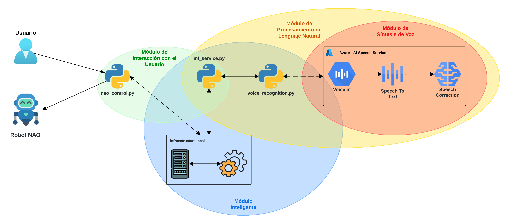

Para facilitar el entendimiento de la solución y de los componentes que la conforman, se ha organizado dichos elementos en cuatro módulos principales: `Módulo de Interacción con el Usuario`, `Módulo Inteligente`, `Módulo de Procesamiento de Lenguaje Natural` y `Módulo de Síntesis de Voz`. El primero, compuesto por `nao_control.py` y `ml_service.py`, facilita la interacción inicial y gestiona las opciones disponibles para el usuario, permitiéndole seleccionar y activar funciones. Luego, el Módulo Inteligente, integrado por `ml_service.py`, `voice_recognition.py` y `la infraestructura local`, centraliza la lógica de machine learning y soporta la estructura de procesamiento. A su vez, el `Módulo de Procesamiento de Lenguaje Natural`, conformado por `ml_service.py`, `voice_recognition.py` y `Azure AI Speech Service`, y el `Módulo de síntesis de voz` transforman el audio a texto y realizan correcciones en el habla, optimizando la precisión en la interpretación de los mensajes.

Cuando el usuario inicia el proceso de integración, accede al componente que controla el NAO a través de un menú de opciones. Al elegir la opción determinada, el sistema se comunica con el componente `ml_service.py`, expuesto en un servidor local y habilitado para recibir solicitudes HTTP. Esto da inicio al proceso de reconocimiento de voz, el cual se lleva a cabo en el componente `voice_recognition.py` con el respaldo del servicio `Azure AI Speech Service`. Durante este proceso, la voz del usuario es convertida a texto y el sistema aplica correcciones de habla para asegurar una interpretación precisa del mensaje. Posteriormente, el texto se envía de vuelta al `ml_service.py`, donde es procesado mediante un modelo BERT preentrenado y ajustado para el español (SaBERT), logrando clasificar el sentimiento como positivo o negativo.

Finalmente, la clasificación obtenida se transfiere de nuevo al componente de control del NAO, el cual responde con una acción específica en función del sentimiento detectado: si la emoción es positiva, el robot NAO ejecuta un baile alegre; mientras que si es negativa, realiza una acción que refleja tristeza, brindando una respuesta natural y contextualizada al estado emocional del usuario.
## Instrucciones de instalación del modelo de IA en el robot NAO
Para el uso del sistema de análisis de sentimiento integrado con NAO v6, es necesario tener instalado el gestor de paquetes y administrador de entornos [Miniconda](https://docs.anaconda.com/miniconda/). Una vez que este requisito sea cumplido, se deben seguir los pasos:

1. En el terminal, crear los entornos correspondientes al controlador de NAO (nao-env) y al servicio del sistema (nao-ml-env) a través de la ejecución de los comandos:

        conda create -n nao-env python=2.7
        conda create -n nao-ml-env python=3.10

2. Descargar el [SDK de Nao v6](https://www.aldebaran.com/en/support/nao-6/downloads-softwares) de la página oficial de Aldebaran. Específicamente el `SDKs 2.8.6 - Python 2.7 SDK` en el caso de Windows. De preferencia, guardar el archivo comprimido en la carpeta `Documentos` para evitar problemas de permisos limitados.

    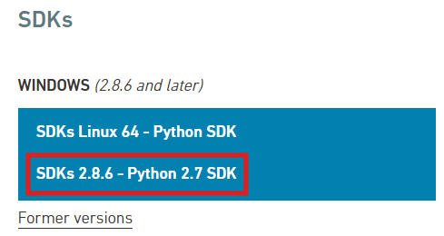

 

3. Modificar el nombre del archivo comprimido a `pynaoqi`, así se evitan inconvenientes por la larga longitud del nombre, la cual puede generar la corrupción de los archivos.

4. Descomprimir el archivo.

5. Una vez descomprimido, ingrese a la carpeta `pynaoqi`, en esta se encontrará con otra que tiene el nombre extenso original, la cual también debe ser renombrada a `pynaoqi`.

6. Copiar dicha carpeta interna que ahora es `pynaoqi`.

7. Pegar la carpeta dentro de la ruta `Disco local (C:) > Usuarios > [tu nombre de usuario] > miniconda3 > envs > nao-env > Lib > site-packages`. La ruta será similar a `C:\Users\andre\miniconda3\envs\nao-env\Lib\site-packages`.

8. Una vez que `pynaoqi` se encuentra dentro de la carpeta `site-packages`, es necesario copiar la ruta de la carpeta `lib` dentro de `pynaoqi`. La ruta será similar a `C:\Users\andre\miniconda3\envs\nao-env\Lib\site-packages\pynaoqi\lib`.

9. Ingresar a `Editar variables de entorno` a través del explorador de Windows.

    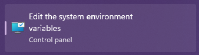

 

10. Presionar `Variables de Entorno...`.

    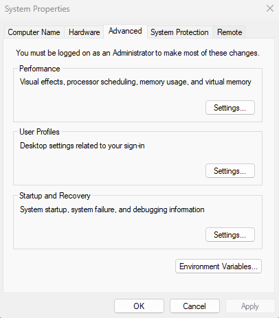

 

11. Crear nueva variable para su usuario con el nombre PYTHONPATH y cuyo valor sea la ruta previamente copiada.

    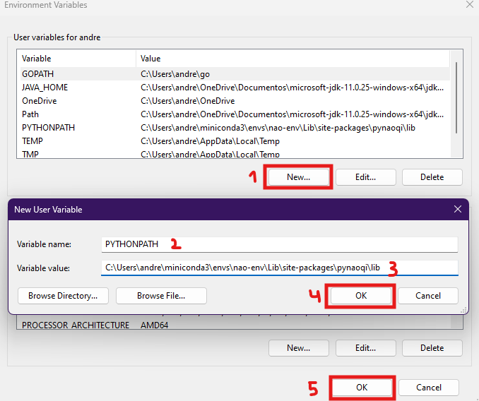

 

12. Verificar que se realizó la instalación correctamente a través del `símbolo del sistema (CMD)`. En este, ingresa el comando `conda activate nao-env`, para luego ejecutar `python`, lo que permitirá correr código de dicho lenguaje en la consola. Una de las bibliotecas por defecto es `numpy`, por lo se debe ingresar `import numpy` y presionar `enter` para verificar que no aparece ningún error. Luego de esto, ingresar `import naoqi` y presionar `enter`. Si después de esto no aparece ningún tipo de mensaje de error, se realizó la configuración correcta.

    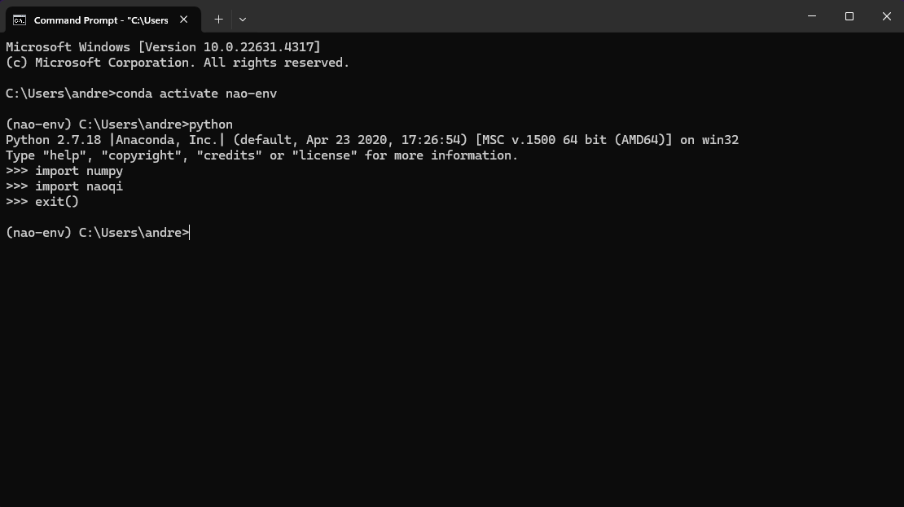

13. Por último, instalar las librerías necesarias para cada entorno a través de los comandos:

        conda activate nao-env
        pip install requests

        conda activate nao-ml-env
        pip install transformers flask torch

## Ejecución del modelo de IA en el robot NAO
Antes de ejecutar el sistema, es necesario descargar el software [Choregraphe](https://drive.google.com/file/d/1fJHgV-SHTfVJ_lM82l8ei6bFOo7mlqRH/view?usp=drive_link) y descomprimir el archivo.

1. Dentro de la carpeta descomprimida, ejecutar `naoqi-bin.exe` dentro de la carpeta `bin`, el cual es el emulador de NAO.

    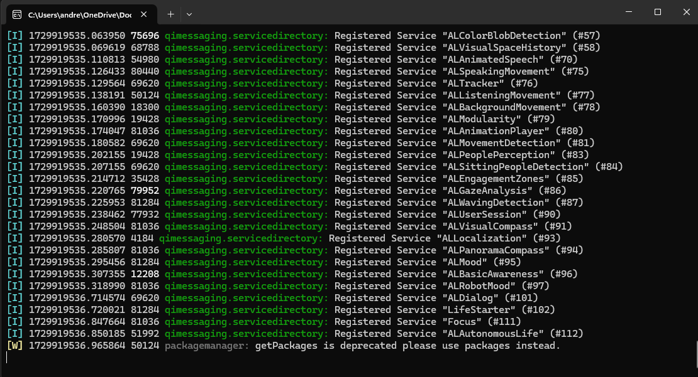

2. Dentro de la carpeta descomprimida ejecutar `choregraphe.bat`. Una vez dentro, se debe ingresar a `Editar > Preferencias` y seleccionar el model de robot `NAO H25 (V6)`. De preferencia, cerrar y volver a abrir `Choregraphe` para que los cambios se realicen correctamente.

    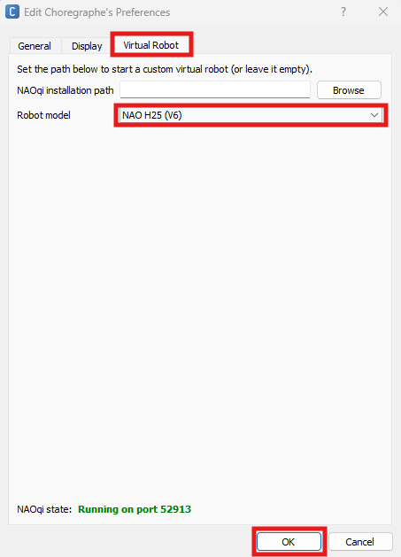

3. Luego, realizar una nueva conexión a la dirección `127.0.0.1` en el puerto `9559` (verificar en el inicio de la consola de `naoqi-bin.exe` que la dirección es la misma). Si en la sección derecha aparece un robot virtual, todos los pasos realizados fueron correctos.

    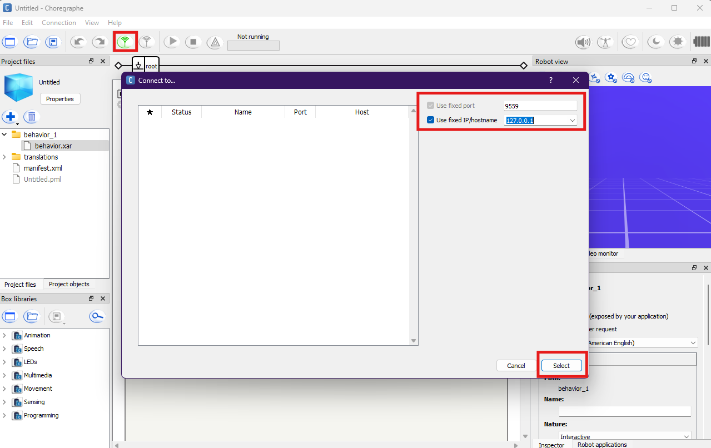

4. Antes de utilizar el sistema, es necesario crear un archivo `.env` en donde se deben especificar la llave API y la región para el servicio de reconocimiento de voz de Azure (Para mayor información, recurrir a la [documentación oficial de Microsoft](https://learn.microsoft.com/en-us/azure/ai-services/speech-service/get-started-speech-to-text?tabs=windows%2Cterminal&pivots=programming-language-python))

    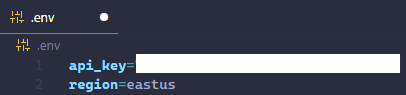

5. Ahora, es necesario abrir la carpeta `nao-project` en Visual Studio Code, en donde se deben abrir dos terminales PowerShell.

    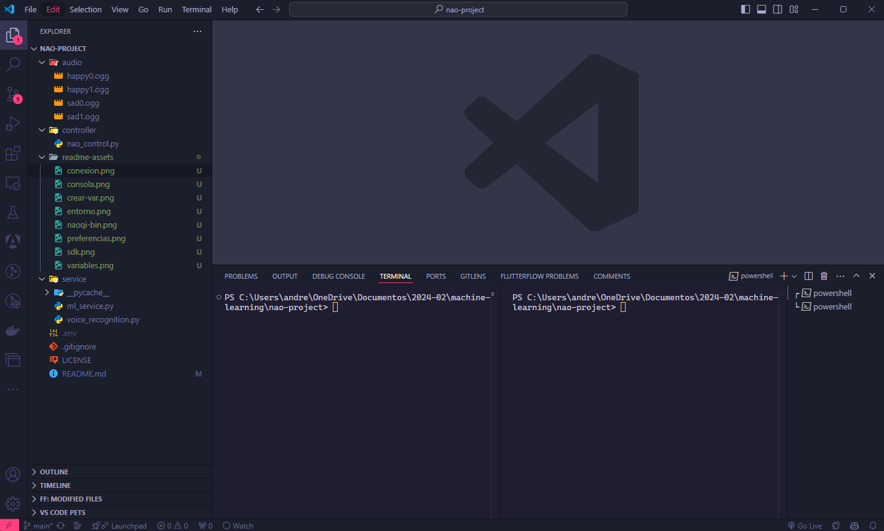

6. Ejecutar el servidor local en la primera terminal a través de los comandos:

        conda activate nao-ml-env
        python .\service\ml_service.py

7. Ejecutar el sistema en la segunda terminal a través de los comandos:

        conda activate nao-env
        python .\controller\nao_control.py

8. Por último, seleccionar una opción, hablar y visualizar los movimientos del robot a través de `Choregraphe`.

    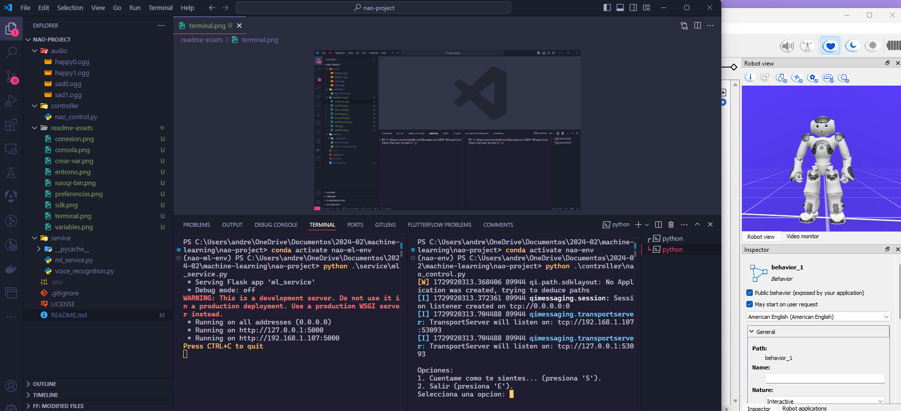

